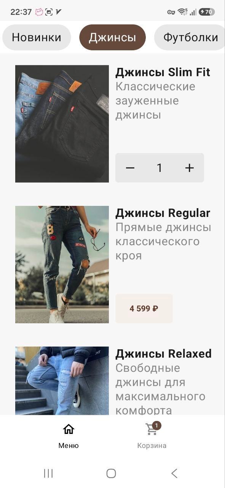
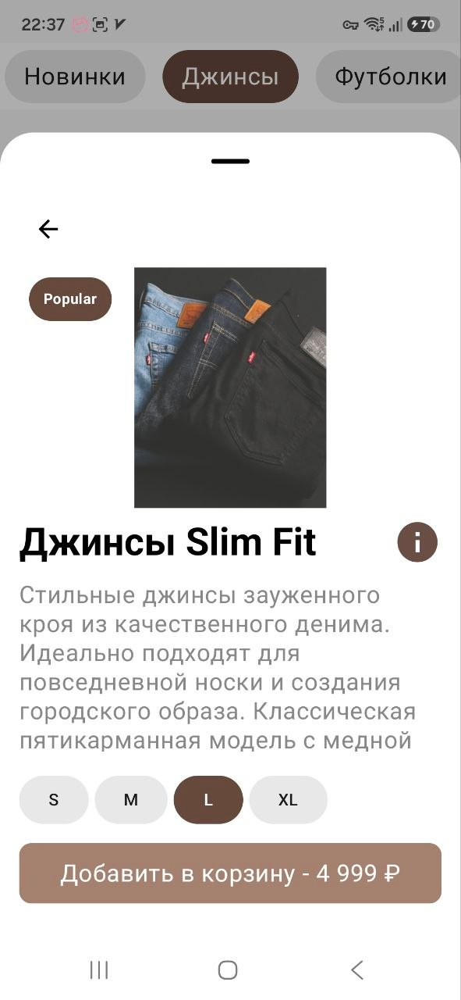
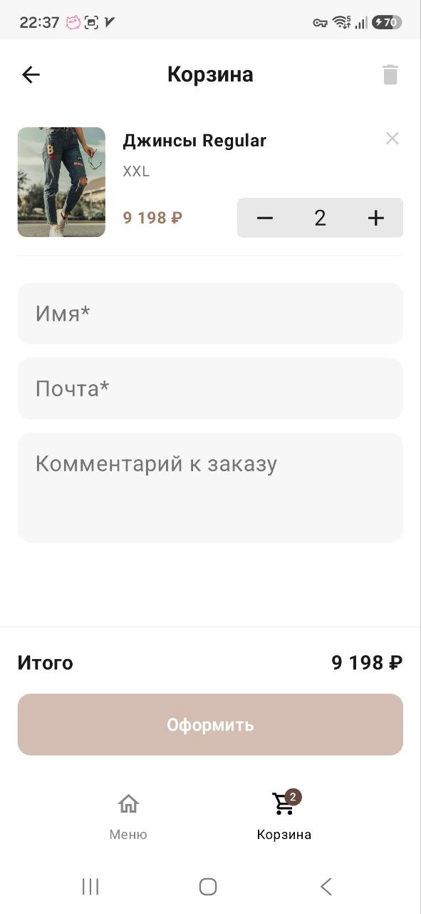
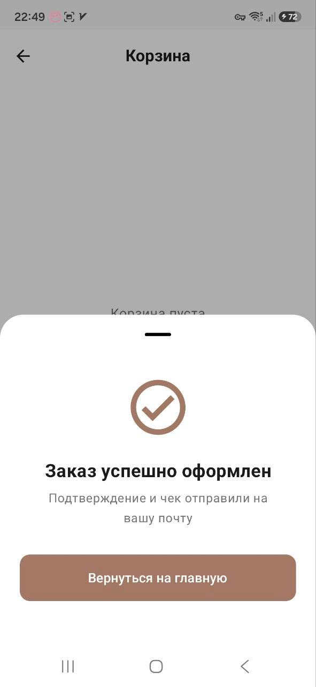

## Студенческий проект: team-kotatsu. FEFU Store 2.0. 
### Описание
Мобильное приложение мобильное приложение-клиент для магазина
FEFU Store. Реализованы экран каталога с фильтрацией, bottom sheet с карточкой товара, содержащая детали, экран корзины с оформлением заказа, а также bottom sheet успешного оформления заказа. Имеется оффлайн режим и кеширование с использованием Room. Реализованы unit тесты, используется linter. Данные для приложения подтягиваются через API.

**Стек** - Android Native (Kotlin, Jetpack Compose).

**Команда:**
- Федосейкин Н.Д. - Team Lead, frontend, backend
- Привалов М.О. - backend
- Егоров А.А. - frontend
- Ким Д.Х. - backend

гр. Б9123-09.03.04

**Скриншоты**

| Каталог                              | Карточка товара     | Корзина                        | Подтверждение заказа                 |
| ------------------------------------ | ------------------- | ------------------------------ | ------------------------------------ |
|  |  |  |  |

**Архитектура проекта**

